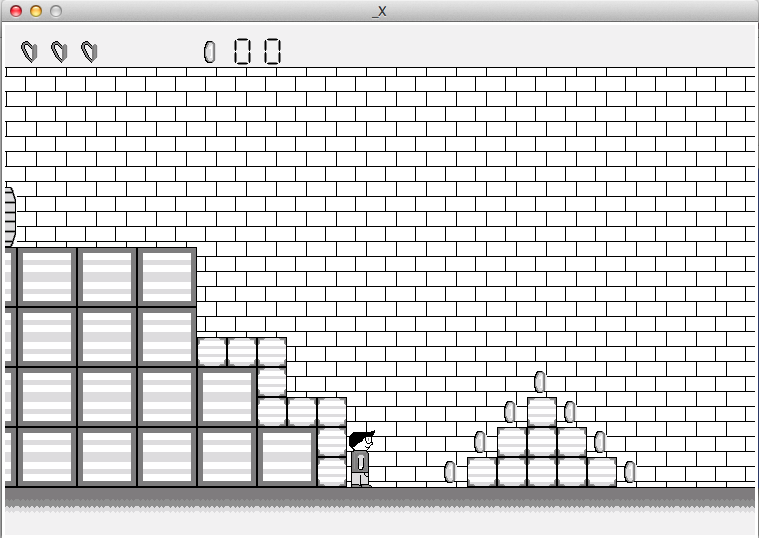

# SHOCK

A plateform game made in Python3

## Screenshot

## Note

"resources" contains all source file to recreate assets.

## Known limitation

- Created on OSX this game may not works on Windows

## Possible Improvements

- Make code more understandable with clearer architecture and comments
- Make it works on windows

## License

Released under Apache License 2.0
